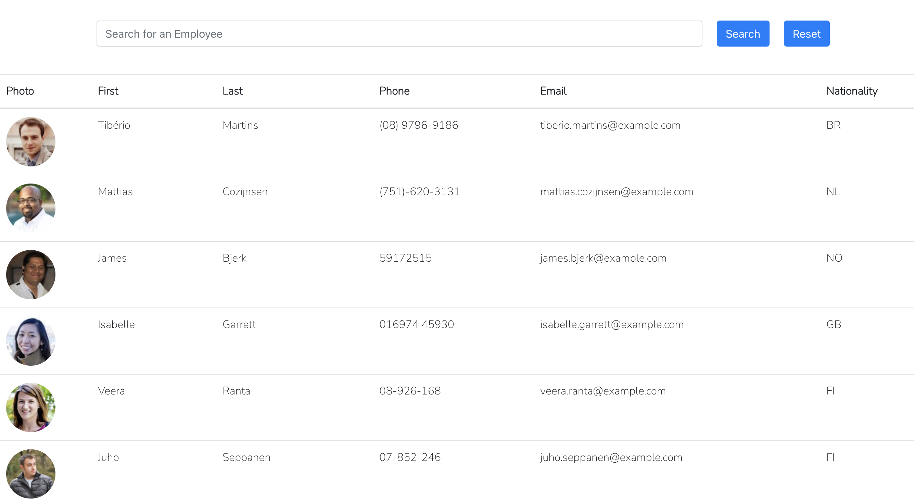

# Employee-Directory
Deployed Link: https://alexandra-hionis.github.io/Employee-Directory/
## Description
Employee Directory is a simple React application that lists a photo, name, phone, email, and nationality of 200 employees and allows users to filter employees' info. Employee information is fetched through a random user API.
## Table of Contents
- [Description](#description)
- [Technologies](#technologies)
- [Usage](#usage)
- [Future](#future)
- [License](#license)
- [Contributing](#contributing)
- [Questions](#questions)
## Technologies
React, JavaScript, and random user generator API
## Future
Getting sort by gender, or even acending or decending order working so it's fully functional.
## Usage
As a user, I want to be able to view my entire employee directory at once so that I have quick access to their information.
As an employee or manager would benefit greatly from being able to view non-sensitive data about other employees. It would be particularly helpful to be able to filter employees by name.

## License
ISC
## Contributing
https://randomuser.me/documentation#format, https://www.youtube.com/watch?v=BwWpG0cNFLU, https://github.com/wuyaheng/employee-directory-with-react/tree/master/src, https://blog.bitsrc.io/understanding-react-v16-4-new-component-lifecycle-methods-fa7b224efd7d, https://medium.com/@valerii.sukhov/react-17-lifecycle-5b68946c813c, https://create-react-app.dev/docs/deployment/#github-pages, https://css-tricks.com/understanding-react-setstate/, https://reactjs.org/docs/faq-state.html
## Questions
GitHub: https://github.com/Alexandra-Hionis  
Email: Alexandra.hionis@gmail.com  
